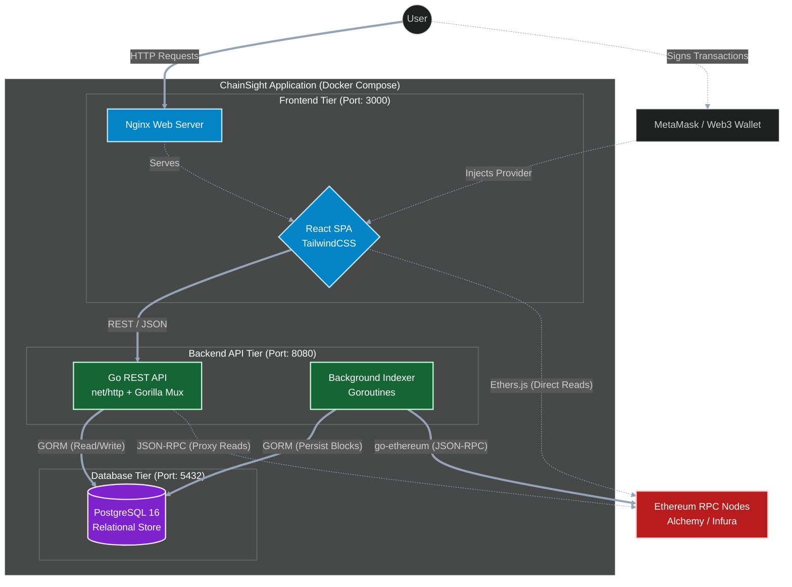

# ChainSight Architecture

ChainSight is organised as a small full-stack monorepo:

- **React frontend** at the repository root (Create React App)
- **Go backend** inside `server/`
- **Shared documentation** inside `docs/`

This document is meant to give a quick mental model of how everything fits together.

## High-Level Architecture Diagram

## Frontend (React)

**Location:** `src/`

The frontend is intentionally structured to separate routing, presentational components, and data-fetching logic:

- `src/pages/`
  - Top-level route components that map to screens.
  - Examples:
    - `BlockPage` – shows latest block / specific block details and transactions.
    - `WalletTest` – basic playground for checking wallet balances and validity.
- `src/components/`
  - Reusable presentational components that receive data via props.
  - Examples:
    - `BlockInfo` – renders high-level block metadata.
    - `TransactionInfo` – shows individual transaction details.
- `src/services/`
  - "Service layer" for the frontend – contains functions that talk to the backend API and encapsulate domain logic.
  - Examples:
    - `blockchainService` – fetch latest block, block by number, transactions, etc.
    - `walletService` – validate Ethereum addresses and fetch balances.
    - `insightsService` – higher-level analytics/insights endpoints.
- `src/api/`
  - Lower-level API adapters, e.g. direct Ethereum JSON-RPC calls or axios/fetch wrappers.
- `src/.env`
  - Contains `REACT_APP_API_BASE_URL`, used to point the React app at the Go backend.

Styling is handled via TailwindCSS and standard CSS files (`App.css`, `index.css`).

## Backend (Go)

**Location:** `server/`

The backend is designed around a conventional Go layout with clear separation between layers:

- `cmd/chainsight-api/`
  - The main entrypoint for the HTTP API server.
- `internal/config`
  - Configuration loading (e.g. environment variables, database DSN, Ethereum RPC URL).
- `internal/httpapi`
  - HTTP router and handler definitions.
  - Exposes endpoints such as:
    - `GET /api/health`
    - `GET /api/blocks/latest`
    - `GET /api/blocks/{number}`
    - `GET /api/wallets/{address}/balance`
- `internal/eth`
  - Ethereum client integration – talks to a configured JSON-RPC endpoint.
- `internal/indexer`
  - Logic for indexing blockchain data into Postgres and computing analytics.
- `internal/store`
  - Database layer using GORM (models, repositories, and Postgres integration).

See [server/README.md](../server/README.md) for detailed instructions on running the backend and a full endpoint list.

## Data Flow

1. The React app calls the Go API using `fetch`/`axios` wrappers from `src/services/*`, using `REACT_APP_API_BASE_URL`.
2. The Go API validates input, calls the Ethereum client or database as needed, and returns JSON.
3. The indexer runs continuously in intervals, pulls blocks from Ethereum, and writes aggregates to Postgres via `internal/store`.
4. Indexed/analytical data is stored and queried from Postgres via the `internal/store` layer.
5. Frontend components stay as dumb as possible, delegating domain logic to the service layer.

## Indexer Scheduling and Rate-Limit Strategy

Indexer runtime behavior:

- Startup: one immediate sync run.
- Continuous mode: repeats on a ticker interval (`INDEXER_INTERVAL_SECONDS`).
- Per tick workload is bounded by `INDEXER_MAX_BLOCKS_PER_TICK`.

Main tuning knobs:

- `INDEXER_INITIAL_LOOKBACK` (default `20`): starting offset when bootstrapping from an empty DB.
- `INDEXER_MAX_BLOCKS_PER_TICK` (default `2`): caps blocks processed per interval.
- `INDEXER_INTERVAL_SECONDS` (default `8`): cadence of indexing runs.

Conservative (rate-limit-safe) profile used in Docker:

- `INDEXER_MAX_BLOCKS_PER_TICK=1`
- `INDEXER_INTERVAL_SECONDS=8`

Combined with retry + exponential backoff in the indexer, this keeps write pressure and RPC burst traffic controlled.

## Local Development Workflow

- **Frontend-only work:**
  - Run `npm start` from the repo root to work purely on React UI, assuming the API is already running.
- **Backend-only work:**
  - Run `go run ./cmd/chainsight-api` from `server/` to iterate on endpoints and database logic.
- **Full-stack testing:**
  - Start Postgres via Docker, run the Go server, then run the React dev server and test the full flow end-to-end.

This structure is intentionally simple but demonstrates clear layering and separation of concerns, which makes it easy to extend in both directions (more UI features or deeper analytics in the backend).